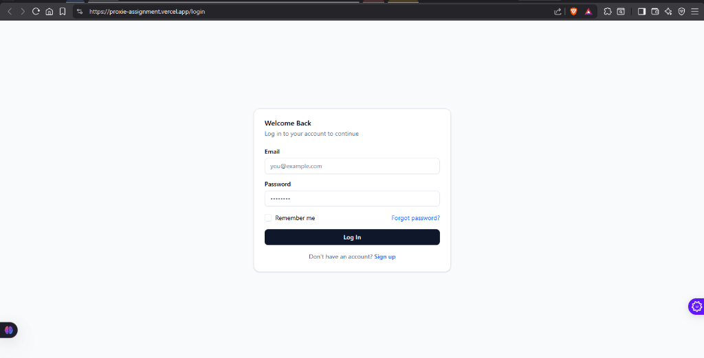
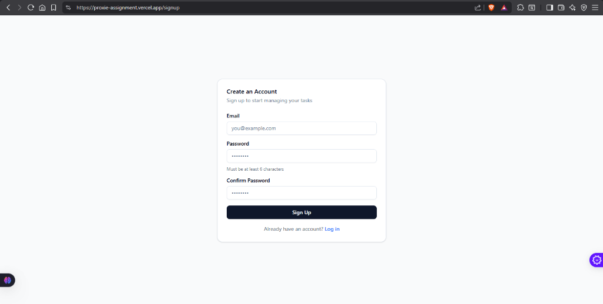
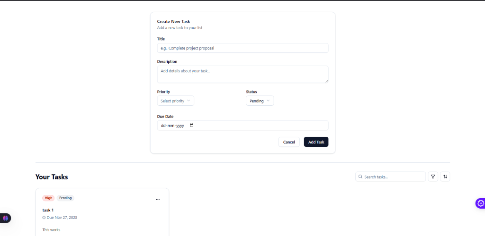

# Task Management Application

A full-stack task management application built with SvelteKit, Supabase, and Tailwind CSS. It allows users to register, log in, and manage their personal tasks through a clean and responsive dashboard.

## Screenshots







## Live Demo

The application is deployed and accessible here:

**URL:** [https://proxie-assignment.vercel.app/](https://proxie-assignment.vercel.app/)

You can use the following credentials for a quick demonstration:

- **Email:** anshulgupta19122001@gmail.com
- **Password:** @NSHUl11

## Features

- **User Authentication:** Secure user registration and login handled by Supabase Auth.
- **CRUD Operations:** Create, Read, Update, and Delete tasks.
- **Task Dashboard:** View all tasks in a single, organized interface.
- **Search & Filter:** Dynamically search by task title and filter by status or priority.
- **Sorting:** Sort tasks by their creation date or due date.
- **Responsive Design:** A mobile-first design that works seamlessly across all devices.
- **Form Validation:** Robust, server-side form validation using Sveltekit Superforms and Zod.

## Tech Stack

- **Framework:** SvelteKit
- **Database & Auth:** Supabase (PostgreSQL)
- **Styling:** Tailwind CSS
- **UI Components:** shadcn-svelte
- **Forms:** Sveltekit Superforms
- **Validation:** Zod
- **Icons:** Lucide Svelte

## Setup and Installation

Follow these steps to set up the project locally.

### Prerequisites

- Node.js (v18 or higher)
- pnpm (or npm/yarn)
- A Supabase account

### 1. Clone the Repository

```bash
git clone git@github.com:anshxpress/Proxie_assignment.git
cd Proxie_assignment
```

### 2. Install Dependencies

```bash
npm install
```

### 3. Set Up Environment Variables

Create a `.env` file in the root of the project and add the following environment variables. You can get these from your Supabase project dashboard under Project Settings > API.

```env
PUBLIC_SUPABASE_URL="your-supabase-url"
PUBLIC_SUPABASE_ANON_KEY="your-supabase-anon-key"
```

### 4. Set Up Supabase Database

Log in to your Supabase account and run the SQL script from `schema.sql` in the SQL Editor to create the tasks table and enable Row Level Security (RLS).

### 5. Run the Application

```bash
npm run dev
```

The application will be available at http://localhost:5173.

## Design Decisions & Assumptions

- **Svelte 5 Runes:** The project leverages Svelte 5 runes (`$state`, `$derived`, `$effect`) for more granular and predictable state management, moving away from the traditional Svelte 3/4 reactivity model.
- **Supabase as BaaS:** Supabase was chosen as the backend-as-a-service to handle the database, user authentication, and row-level security. This simplifies the backend infrastructure and allows for rapid development.
- **Component Library:** `shadcn-svelte` was used for its accessible, unstyled components, providing a solid foundation that can be easily customized with Tailwind CSS.
- **URL-Driven State:** The dashboard's filtering and sorting state is managed via URL search parameters. This makes the views shareable and bookmarkable, and provides a clear source of truth for the data being displayed.
- **Server-Side Logic:** All database operations and form validations are handled on the server within SvelteKit's `+page.server.ts` files to ensure security and data integrity.

## Third-Party Libraries Documentation

- **sveltekit-superforms:** Used to manage form state, validation, and progressive enhancement with minimal boilerplate. It works seamlessly with Zod schemas.
- **zod:** A TypeScript-first schema declaration and validation library. It's used to define the shape of our task data and validate form submissions.
- **bits-ui:** The underlying, unstyled component primitives that power `shadcn-svelte`.
- **clsx & tailwind-merge:** Utility libraries for conditionally joining Tailwind CSS classes without style conflicts.

## Known Issues & Limitations

- **No Real-Time Updates:** The dashboard does not currently subscribe to real-time database changes. A page refresh is required to see tasks updated by another client.
- **No Password Reset:** The authentication flow does not include a "Forgot Password" feature.
- **Basic Date Picker:** The form uses the native browser date picker, which has an inconsistent appearance across different browsers. A custom date picker component would provide a better user experience.
- **Limited Test Coverage:** The project currently lacks an automated testing suite (e.g., Vitest, Playwright).
